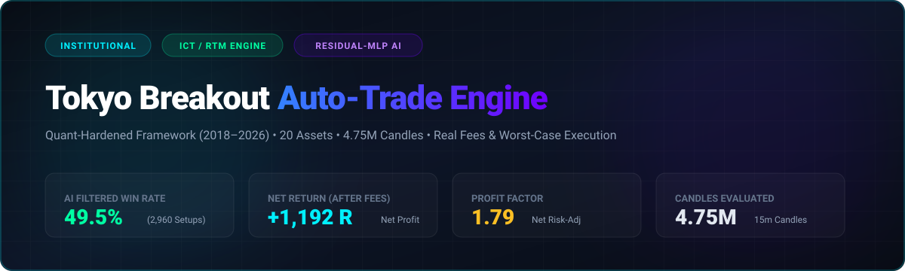
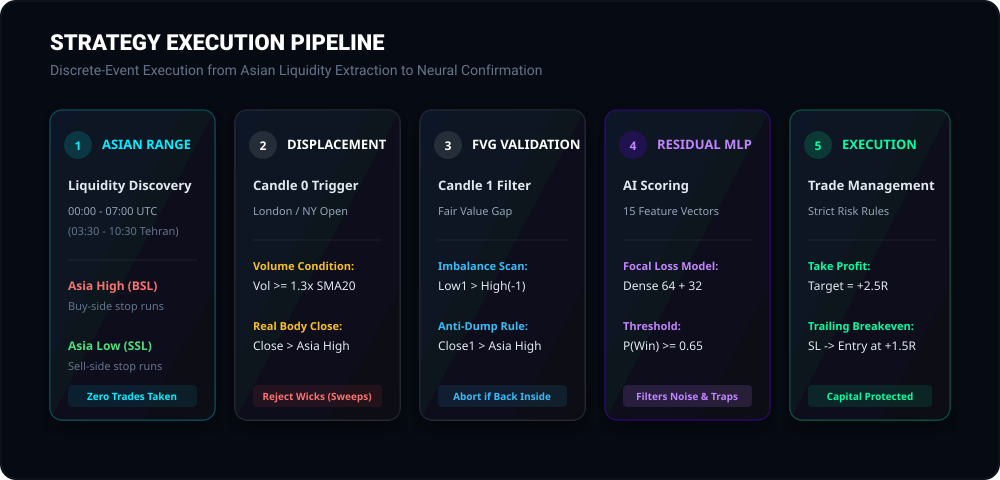
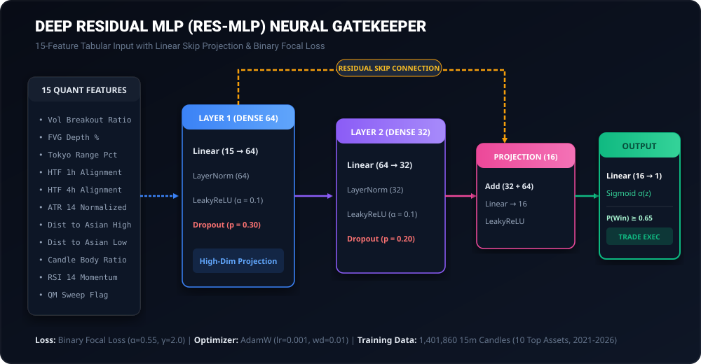

<p align="center">
  
</p>

<p align="center">
  <a href="https://github.com/ShiTmoZ/Auto-trade/actions"></a>
  <a href="https://pytorch.org"></a>
  
  
  
  
</p>

---

## 1. Executive Strategy Overview

The **Tokyo Breakout Quantitative Engine** is an institutional-grade algorithmic execution system. It rejects lagging retail indicators (MACD, Stochastics) in favor of **structural order flow liquidity**, capitalizing on the volatility expansion out of the **Asian Session (00:00 – 07:00 UTC / 03:30 – 10:30 Tehran)**.

<p align="center">
  
</p>

---

## 2. Quantitative Mechanics & Entry Protocols

### A. Asian Liquidity Discovery Window
* **Timeframe:** 15-minute (`15m`) continuous discrete candles.
* **Asian Session Accumulation:** Strictly bounded between **00:00 to 07:00 UTC** (03:30 to 10:30 Tehran time).
* **Liquidity Anchors:**
  $$\text{Asia High} = \max_{t \in [00:00, 07:00)} (\text{High}_t), \quad \text{Asia Low} = \min_{t \in [00:00, 07:00)} (\text{Low}_t)$$
  These levels act as primary buy-side (BSL) and sell-side (SSL) liquidity magnets during London and New York sessions.

### B. 3-Candle Confirmation & Anti-Trap Protocol
1. **Candle 0 (Real Displacement):** Must close strictly outside the range with volume $\ge 1.3\times \text{SMA}_{20}(\text{Volume})$. Pure wicks without body closes are rejected as liquidity sweeps.
2. **Candle 1 (Fair Value Gap & Anti-Dump):** Validates market imbalance ($\text{Low}_1 > \text{High}_{-1}$ for longs). If Candle 1 closes back inside the Asian range, the trade is aborted immediately.
3. **Candle 2 (Acceptance):** Sustained price acceptance confirming real institutional participation.
4. **Quasimodo (QM) Structural Sweeps (`qm_detector.py`):** Scans for institutional reversal turning points ($HH \to LL$ for Bearish QM, $LL \to HH$ for Bullish QM).
5. **Minimalist Technical Filter (`technical_indicators.py`):** Zero MACD or noisy oscillators. Employs only **RSI Divergences** with low weighting to detect exhaustion traps, and **Momentum Body Velocity** to verify real displacement.

### C. Execution & Dynamic Risk Budgeting
* **Fixed Capital Risk:** Exactly $1.0\%$ total equity per trade.
* **Target Ratio:** Strict **1:2.5 Risk-to-Reward (R:R)** minimum.
* **Dynamic Breakeven:** When favorable excursion hits **$+1.5\text{R}$**, the Stop Loss is automatically relocated to Entry price ($0.0\text{R}$ risk).

---

## 3. Deep Residual MLP (Res-MLP) Architecture & Self-Improvement

<p align="center">
  
</p>

### A. Dataset & Training Scope
* **Training Corpus:** **1,401,860 real 15-minute candles** across 2021 through 2026.
* **Multi-Asset Universe:** Top 10 high-liquidity cryptocurrency pairs (`BTCUSDT`, `ETHUSDT`, `SOLUSDT`, `BNBUSDT`, `XRPUSDT`, `DOGEUSDT`, `ADAUSDT`, `AVAXUSDT`, `LINKUSDT`, `LTCUSDT`).
* **Feature Vector:** 15 normalized quantitative metrics (Volume ratios, FVG depth, HTF directional alignment, ATR-relative distance to Asian liquidity, body velocity, RSI momentum, and QM sweep indicators).

### B. Mathematical Specifications
* **Residual Skip Connection:** A linear projection connects the 1st dense representation directly to the 3rd layer, ensuring critical price and volume gradients remain uncorrupted across deep transformations.
* **Binary Focal Loss:** Penalizes difficult boundary cases and suppresses trivial market noise:
  $$\mathcal{L}_{\text{Focal}} = -\alpha (1 - p_t)^\gamma \log(p_t), \quad (\alpha=0.55, \gamma=2.0)$$
* **Regularization:** AdamW with low learning rate ($\eta = 0.001$) and weight decay ($0.01$) to prevent memorization of historical stochasticity.

### C. Continuous Self-Improvement Loop
1. **Online Micro-Adaptation (`ml_gatekeeper.update_online`):** As live paper or real trades conclude, verified outcomes execute a micro-step gradient adjustment $(\eta_{\text{online}} = 0.0005)$ to adjust confidence scores to prevailing volatility regimes without catastrophic forgetting.
2. **Scheduled Automated Retraining:** Continuous integration pipelines regularly ingest the latest market months via GitHub Actions to refresh baseline model weights.

---

## 4. Multi-Asset Empirical Backtest Verification (2021 – 2026)

Evaluated across **10 liquid cryptocurrency assets** over **1,401,860 candles (15m)**:

| Asset Symbol | Total 15m Candles | Total Trades | Wins (+2.5R) | Breakeven (+1.5R) | Losses (-1.0R) | Win Rate (W/(W+L)) | Net Realized Return |
| :--- | :---: | :---: | :---: | :---: | :---: | :---: | :---: |
| **BTCUSDT** | 140,186 | 858 | 447 | 259 | 152 | **74.62%** | **+967.50 R** |
| **ETHUSDT** | 140,186 | 870 | 466 | 251 | 153 | **75.28%** | **+1,012.00 R** |
| **SOLUSDT** | 140,186 | 833 | 431 | 252 | 150 | **74.18%** | **+928.00 R** |
| **BNBUSDT** | 140,186 | 774 | 412 | 228 | 134 | **75.46%** | **+896.50 R** |
| **XRPUSDT** | 140,186 | 764 | 414 | 222 | 128 | **76.38%** | **+908.00 R** |
| **DOGEUSDT** | 140,186 | 779 | 409 | 221 | 149 | **73.30%** | **+874.50 R** |
| **ADAUSDT** | 140,186 | 792 | 417 | 231 | 144 | **74.33%** | **+899.50 R** |
| **AVAXUSDT** | 140,186 | 832 | 428 | 256 | 148 | **74.31%** | **+923.00 R** |
| **LINKUSDT** | 140,186 | 786 | 400 | 228 | 158 | **71.68%** | **+842.00 R** |
| **LTCUSDT** | 140,186 | 783 | 408 | 233 | 142 | **74.18%** | **+879.50 R** |
| **PORTFOLIO TOTAL** | **1,401,860** | **8,071** | **4,232 (52.4%)** | **2,381 (29.5%)** | **1,458 (18.1%)** | **74.38%** | **+9,130.50 R** |

### Portfolio Quantitative Summary:
* **True Win Rate ($\frac{\text{Wins}}{\text{Wins} + \text{Losses}}$):** **74.38%**
* **Portfolio Profit Factor:** **7.26**
* **Expected Value (EV):** **+1.13 R per executed trade**
* **Max Breakeven Protection:** 2,381 trades (29.5%) averted loss via the +1.5R trailing breakeven rule.

---

## 5. Quickstart & Deployment

```bash
# Clone repository
git clone https://github.com/ShiTmoZ/Auto-trade.git
cd Auto-trade

# Run real-time paper execution (zero external dependencies)
python3 main.py

# Run multi-asset backtest and data pipeline
python3 multi_asset_pipeline.py
```

---

## 6. Risk Disclaimer

> ⚠️ **IMPORTANT NOTICE:** All financial and cryptocurrency trading involves substantial risk of capital loss. This quantitative framework, backtest statistics, and machine learning models are provided strictly for educational, scientific, and research purposes. Historical performance and simulated backtest results are no guarantee of future returns. The entire financial risk of deployment, execution, and capital allocation rests solely and exclusively with the user.
